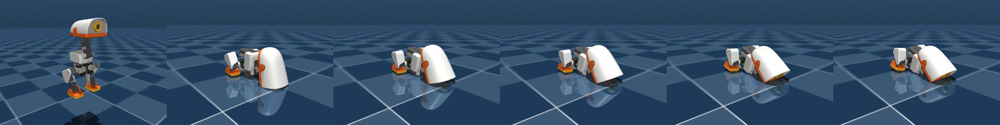
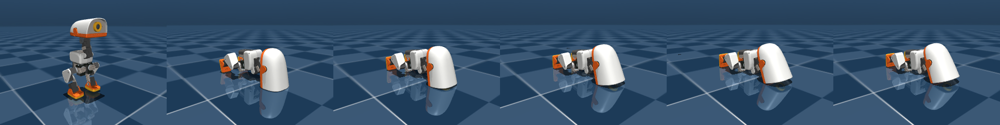

# microduck-rl-cpu — robot learning on a laptop with no GPU

Project 3 of a CPU-only ML track. The target is a balance-and-recover policy for
the [Microduck](https://github.com/pollen-robotics/microduck_rl) — a 25 cm,
737 g open-source biped with 14 position-controlled servos — trained in MuJoCo,
evaluated on physics it never trained on, and exported to ONNX.

The reason this project exists in this form: upstream trains the duck with
mjlab on MuJoCo Warp, which requires CUDA. There is no GPU on this machine and
no hardware to buy. So the whole thing runs the same MJCF in plain CPU MuJoCo,
parallel across processes, inside an 8-of-14-thread budget on a laptop that
has other work to do.

**Steps 1 and 2 are done.** Step 1 is the feasibility gate: is this machine
fast enough to train a policy at all. Step 2 is the environment contract — what
the policy sees, what it emits, when an episode ends — and the baseline it has
to beat. Steps 3-5 are not started.

Step 1's throughput numbers were re-measured on 2026-09-10 and came back 40%
higher across 8 processes. The original table had been taken on a machine in a
reduced-power state that is not visible from inside WSL. Both tables are kept
below, because the difference between them is the useful part.

---

## Step 1 — can this box simulate the duck fast enough?

One **env step** is one 50 Hz control decision, which is 10 physics steps at the
model's 500 Hz timestep. RL budgets are quoted in env steps, so the gate is
written in them. The gate was set before measuring: **below 5,000 env-steps/s at
8 processes, walking leaves the scope and the project becomes stand-only.**

MuJoCo's step for a 16-body model is single-threaded and small enough to stay in
cache, so parallelism has to come from processes. Every worker runs with
`OMP_NUM_THREADS=1`, set before MuJoCo loads, or the workers spawn thread pools
and fight each other.

### Scaling, `walk` variant, 20 s per configuration

| processes | env-steps/s | per process | speedup | efficiency |
|---|---|---|---|---|
| 1 | 6,521 | 6,521 | 1.00x | 100% |
| 2 | 12,555 | 6,278 | 1.93x | 96% |
| 4 | 21,424 | 5,356 | 3.29x | 82% |
| 8 | 28,749 | 3,594 | 4.41x | 55% |

**Every row here is a 20-second burst.** The sweep pauses between
configurations to re-measure its single-process reference, and the package
cools in those pauses. Held for four minutes the 8-process row falls to 19,356
and the speedup to 2.97x — see *What a training run gets is not 28,749*. Use
this table for scaling behaviour, never for a training budget.

**Gate: PASS, 5.7x over.** The single-process reference window between
configurations held to within 6% across the whole sweep, so the four rows were
measured on the same machine as each other. `runs/bench_main.json`.

The sweep was run twice, seven minutes apart, and the 8-process row came back
28,960 and 28,749 — 0.7% apart. `runs/bench_main2.json` is the first of the
two, kept because a single benchmark is an anecdote. Note that this is much
tighter than the ±10% run-to-run spread quoted further down, which was measured
on the machine in its degraded state; on a healthy box the sweep is repeatable
to about a percent.

### These are the second set of numbers, and the first set is the interesting one

Step 1 originally certified this:

| processes | env-steps/s | efficiency | vs the table above |
|---|---|---|---|
| 1 | 6,666 | 100% | +2% |
| 2 | 9,801 | 74% | −22% |
| 4 | 14,275 | 54% | −33% |
| 8 | 20,474 | 38% | −29% |

Same code, same variant, same 8-of-14 thread budget, same laptop on mains
power. The difference is a host state the guest cannot read.

Read the shape rather than the totals, because the shape is the whole
diagnosis: **single-process is flat within run-to-run spread, and every
multi-process row is roughly a third lower.** Thermal throttling decays with
time under load and would have moved the reference windows within the sweep.
Another process competing for CPU depresses every row, the single-process one
included. A sustained all-core power limit does exactly this and nothing else —
single-core turbo never depended on the all-core budget, every additional core
did.

The tell that should have caught it at the time is the 2-process row. **Two
processes on a fourteen-core machine returned 74% efficiency.** There is no
core-count explanation for that; two workers cannot contend for cores when
twelve are idle. I read 74% as a property of the chip and built a scaling story
on top of it, and it was a property of the machine's power state that
afternoon.

There was a deeper excursion in the same window. While step 2 was being built
the single-process rate fell to **3,069 env-steps/s**, 46% of certified, with
the box idle. `bench.py`'s reference bracket called that run stable, and it was
right to: the tool detects a reference that *moves during a sweep*, and this was
a machine that was uniformly slow for the whole sweep. Worth naming as a
limitation of the method — **a drift guard cannot catch a bias that is already
in place when the first window opens.** The only defence is an absolute
expectation, which is what the certified table now provides.

Both recovered after a check on the Windows side. **Which setting changed is
not recorded, and that is the finding rather than a hole in it:** a WSL2 guest
cannot read power mode, charger wattage, package power or core frequency, so
host state is unrecoverable after the fact and has to be written down at
measurement time or lost. The guest-visible substitute is the single-thread
versus all-core shape above.

**None of this is a reason to push the machine harder.** The thread budget
stays at 8 of 14.

### What a training run gets is not 28,749

Three separate reasons, and all of them cut the number.

**First, the sweep pauses and a training run does not.** The sweep brackets
every configuration with a single-process reference window, which lets the
package cool between measurements. A training run never gets that pause.
Holding 8 processes flat out for four minutes on the recovered machine:

| elapsed | env-steps/s | vs peak |
|---|---|---|
| 20 s | 33,349 | — |
| 40 s | 30,935 | −7% |
| 80 s | 29,262 | −12% |
| 120 s | 27,313 | −18% |
| 160 s | 25,323 | −24% |
| 200 s | 23,931 | −28% |
| 220 s | 19,456 | −42% |
| 240 s | 19,256 | −42% |

Monotonic in all twelve windows. The final step is −1.0%, so the curve has
just about flattened — but only just, and twelve windows is the least that
shows a floor at all.

The same test in the reduced-power state read 27,905 in its first window and
then eleven windows at 20,152 ± 287: a 5% spread with no trend. **That is not
a decay curve, and the −28% this README previously quoted from it was the
ratio of a flat plateau to one turbo window.** The two runs are worth more
together than separately:

| | first window | after four minutes |
|---|---|---|
| reduced-power state | 27,905 | 20,152 |
| recovered | 33,349 | 19,356 |

**The floors agree to 3.9%.** The host power state changed how much burst the
machine had to spend, not where it ended up. Four minutes into an 8-process
load this box does about 19,400 env-steps/s of bare `walk` physics in either
state, and that — not 28,749 — is what a training run lives on.

`runs/bench_sustained.json`, reproduced by:

```bash
nice -n 10 python3 bench.py --sustained 8 --seconds 20 --windows 12 --tag sustained
```

**Second, `bench.py` does not measure the thing that gets trained.** Its worker
is a bare `mj_step` loop on `walk`. The task runs the Python environment
wrapper on `groundcontact`, and both of those cost:

| single process, 10 s windows | bare `mj_step` | through `MicroduckEnv` | wrapper cost |
|---|---|---|---|
| `walk` | 7,505 | 5,692 | 32% |
| `groundcontact` | 5,223 | 4,175 | **25%** |

`runs/bench_wrapper.json`, reproduced by `bench_wrapper.py`. `groundcontact`
enables ten ground-collidable geoms against `walk`'s two, so it is 30% slower
before any Python runs.

About half of that 25% is a correctness fix rather than wrapper overhead.
`mj_step` integrates `qpos` and `qvel` but leaves `sensordata` and `xpos` a
substep behind, so `step()` now calls `mj_forward` before reading them; that
alone costs 7% of throughput and is the reason the figure moved from 13% to
25% during step 2. It is not an optimisation target — see *Known risks going
into step 3*.

This also corrects an earlier claim in this README that the wrapper cost
**0%**, measured at 2,771 against 2,776 env-steps/s. That measurement was taken
during the reduced-power window, where the physics was slow enough to hide a
fixed Python cost underneath it. On a healthy box the wrapper is visible. 0%
was wrong, and it was wrong in the flattering direction.

**Third, `groundcontact` does not scale like `walk`.** Running the sweep on
the variant the task actually uses, same conditions, `runs/bench_gc.json`:

| processes | `groundcontact` | efficiency | `walk` | efficiency |
|---|---|---|---|---|
| 1 | 4,405 | 100% | 6,521 | 100% |
| 2 | 7,440 | 84% | 12,555 | 96% |
| 4 | 10,701 | 61% | 21,424 | 82% |
| 8 | 14,790 | **42%** | 28,749 | 55% |

Gate PASS, 3.0x over. **These rows were measured on a dirty box and the
absolute numbers are not quotable.** The run was started eight seconds after
the four-minute sustained soak above, and `bench.py` said so at the time —
`WARNING 1-min load average 7.38` — but printed the warning to the terminal
and wrote a JSON marked `"stable": true` with no trace of it. The file was
later read on its own and believed.

The contamination is visible in the reference sequence: 4,172 → 4,382 → 4,541
→ 4,534 → 4,321. Three rising windows spanning 8.8%. That is not scatter, it
is the machine recovering from the soak *during* the sweep, so the 1-process
row was taken at the bottom of the recovery and the 8-process row after it.
The old drift check tested only magnitude against a 10% bar and passed it.

**What survives is the comparison, not the levels.** The efficiency column is
a ratio of two rows measured minutes apart on the same recovering box, and the
bias runs against the conclusion: the 1-process baseline was the most
depressed row, which *overstates* efficiency at 8 processes. Recomputed
against the recovered reference of 4,541 it is 40.7%, not 42%. Either way it
is far below `walk`'s 55%, and that gap is the finding.

**Scaling was not a property of the machine alone.** The variant with five
times the ground-collidable geoms loses efficiency earlier and ends 13 points
lower at 8 processes. That is the signature of a shared resource outside the
core — L3 or memory bandwidth — and against a performance-core/efficiency-core
split, which would not care how much contact work each process does. It does
not prove the bandwidth hypothesis, but it is the first evidence for it that
was obtainable from inside the guest, and it arrived by accident: the point of
the run was the budget number.

### The number a training run should be budgeted on

Measured directly, on the variant that gets trained, under the load it gets
trained at: `--sustained 8 --variant groundcontact --windows 18`,
`runs/bench_gc_sustained.json`.

| elapsed | env-steps/s | vs peak |
|---|---|---|
| 20 s | 30,129 | — |
| 60 s | 23,868 | −21% |
| 120 s | 21,160 | −30% |
| 180 s | 18,761 | −38% |
| 240 s | 15,530 | −48% ← contaminated, see below |
| 300 s | 15,806 | −48% |
| 360 s | 17,266 | −43% |

The shape is not the `walk` shape. `walk` slid monotonically to a floor and
stayed there. `groundcontact` **undershoots at window 11 and then climbs back
for six windows**, ending 11% above its minimum and still rising +0.6% at the
last window. So this is not a steady state either, and eighteen windows found
the dip rather than the floor.

Two disclosures. **Window 11, the global minimum, is contaminated** — a
10-second two-process benchmark of my own overlapped it, on a box already
running eight workers, and for a bandwidth-bound variant that is the sensitive
axis. It is excluded below. And an earlier version of the settled-check in
`bench.py` called this curve settled, because it only tested for a *fall*; a
rising tail is equally not a steady state, and it now tests both directions
and prints the plateau band instead of a single tail number.

Excluding window 11, the last nine windows run **15,806 to 17,266, a 9% band,
mean 16,590.** That band is the honest uncertainty, and the budget uses its
middle rather than its top.

**One factor is still inherited:** the wrapper, 4,175 / 5,223 = 0.799,
measured single-core on an idle box. Everything else is now a direct
measurement of the right workload in the right state.

**16,590 × 0.799 = ~13,300 env-steps/s.** Range 12,600–13,800 across the band.

#### This correction went the other way, and that is the interesting part

The previous figure was 8,000, and it was too low for two compounding reasons,
both visible only once this run existed:

- The `groundcontact` sweep it was built on read **14,790 at 8 processes —
  11% *below* this sustained run.** A burst measurement cannot legitimately
  come in under a sustained one. That is proof, after the fact, that the sweep
  was measured on a soaked box.
- That already-depressed number was then multiplied by a 0.673 sustained
  derate borrowed from `walk`. **The derate was counted twice.**

So the tally for this one number is 28,749 → 18,400 → 8,000 → 13,300. Three
corrections downward from unmeasured optimism, then one upward from stacking
two safety factors on the same effect. **Being conservative is not free and it
is not automatically honest** — an unmeasured pessimistic assumption is the
same error as an unmeasured optimistic one, and it costs real scope. The fix
in both directions was identical: measure the thing itself instead of
composing estimates of its parts.

| budget | at ~13,300 |
|---|---|
| 10M (hyperparameter probe) | 13 min |
| 50M (stand + push recovery, expected) | 1.0 h |
| 100M (stand, generous) | 2.1 h → 2 chunks |
| 400M (walking gait, upstream-scale) | 8.4 h → 5 chunks |

**Scope conclusion: stand-and-recover is one comfortable sitting, walking is
five chunks.** That was the question the gate had to answer, and it survived
all four revisions of the number, which is the only reason the revisions were
tolerable.

What would still improve it, in order of value: a re-run with `--windows 30`
to find whether the climb after window 11 continues or plateaus, and a
wrapper measurement taken under 8-process load instead of single-core.
Neither changes the scope conclusion, so neither blocks step 3.


### Why efficiency still falls to 55% at 8 processes, and what I could not determine

96% at two processes and 82% at four are unremarkable. 55% at eight is not.
This chip is an Intel Core Ultra 5 225H: 14 cores, no hyperthreading, and
heterogeneous — a handful of performance cores alongside efficiency cores. The
obvious hypothesis is that workers 5-8 land on slower cores.

I tried to test it by pinning four workers to CPUs 0-3 and then to CPUs 10-13:

| pinned to | per process | 1-process reference |
|---|---|---|
| CPUs 0-3 | 3,883 | 6,129 |
| CPUs 10-13 | 3,379 | 5,769 |

A 15% difference under load, 6% single-threaded. Far too small for a
performance-core versus efficiency-core split, which would show roughly 2x.

The explanation is that **CPU affinity inside WSL2 does not pin to a physical
core.** `sched_setaffinity` binds the process to a virtual CPU, and the
hypervisor schedules virtual CPUs onto physical cores on its own. So this
experiment cannot answer the question, and neither can any other experiment run
from inside the guest. The remaining candidates — shared 18 MB L3, memory
bandwidth, hypervisor scheduling, sustained power — are not separable from here.

**Pinning was the wrong instrument. Changing the workload worked.** The
`groundcontact` sweep above loses efficiency earlier than `walk` and ends 13
points lower at 8 processes, on the same cores in the same session. A
core-type split cannot produce that: which physical core a process lands on
does not depend on how much contact solving it does. A shared resource outside
the core can, and does. That points at L3 and memory bandwidth over the other
two candidates. It is one comparison between two variants, not a proof, and
the honest way to test it would be to sweep a variant with more geoms still.

Those two rows predate the recovery described above and have not been repeated;
their single-process references, 6,129 and 5,769, sit between the degraded and
recovered rates, so the machine was somewhere in the middle when they were
taken. The conclusion they support is architectural rather than numeric, so it
survives, but the numbers themselves should not be quoted.

I am recording this as unresolved rather than picking the plausible-sounding
answer. What matters operationally is settled anyway: **8 processes is the
right choice**, because it delivers the most total throughput even at 55%
efficiency.

---

## Three things about the model that changed the plan

### 1. On the `walk` model, only the feet can touch the ground

MuJoCo lets two geoms collide only if one's `contype` shares a bit with the
other's `conaffinity`. In `robot_walk.xml` the floor is 1/1, the two foot geoms
are 1/1, and **every other body and limb geom is 2/2**. Two and one share no
bits. So the trunk, head and legs cannot touch the floor at all.

Hold the STAND pose and let it topple:

| variant | geoms that can touch the floor | trunk at rest |
|---|---|---|
| `walk` | 2 (the feet) | **−10.5 cm — through the floor** |
| `groundcontact` | 10 | +3.2 cm — resting on it |

This is deliberate upstream. A walking task terminates the episode the instant
the robot falls, so what happens afterwards never has to be physical, and
dropping the collision geometry makes the sim faster. It makes `walk` the wrong
model for anything that involves lying on the ground or getting back up.

The failure is silent. Nothing raises, no contact is reported, the robot just
sinks. A reward function reading trunk height would have been quietly rewarded
for falling through the world.

**Decision: the stand-and-recover task in step 2 uses `groundcontact`, not
`walk`.** Recovery requires the robot to actually rest on the floor.

### 2. The backlash variant renumbers qpos, and that is the variant policies get evaluated on

Four variants ship, all exposing the **same 14 actuators under the same names in
the same order**:

| variant | nq | nv | passive joints | action space |
|---|---|---|---|---|
| `walk` | 21 | 20 | 0 | identical |
| `groundcontact` | 21 | 20 | 0 | identical |
| `rollers` | 25 | 24 | 4 | identical |
| `walk_backlash` | 35 | 34 | 14 | identical |

That the action space is identical is what makes the sim-to-sim step possible: a
policy trained on one variant runs on another with no remapping. The held-out
physics is supplied by the robot's own authors rather than invented here, which
is a much stronger position than randomising parameters and testing on the same
randomisation.

But `walk_backlash` inserts a passive backlash joint in series with **every**
actuated joint, and those passive joints interleave. The actuated joint angles
sit at qpos indices 7, 9, 11 … 33, not the contiguous 7…20 they occupy on
`walk`. Any observation builder that hardcodes `qpos[7:21]` reads a mixture of
joint angles and backlash deflections on the evaluation model — plausible
numbers, wrong meaning, no error. Everything here goes through
`common.actuated_qpos_index()` instead, and a test asserts the stride.

### 3. Joint friction is the parameter the hardware people disagree about by 6.7x

`joints_properties.xml` ships four fitted actuator classes for the same XL330
servo — different people, different benches, all left in the file:

| class | damping | frictionloss | armature | kp | force limit |
|---|---|---|---|---|---|
| `chosen_actuator` | 0.053 | 0.0048 | 0.0018 | 0.550 | 0.96 |
| `chosen_actuator_old` | 0.048 | 0.0060 | 0.0020 | 0.520 | 0.91 |
| `chosen_actuator_new` | 0.041 | 0.0320 | 0.0020 | 0.386 | 0.67 |
| `chosen_actuator_antoine` | 0.044 | 0.0130 | 0.0017 | 0.430 | 0.75 |
| **spread (max/min)** | **1.29x** | **6.67x** | **1.18x** | **1.42x** | **1.43x** |

Damping, armature, gain and torque limit agree to within about 40%. Friction
loss disagrees by a factor of seven.

This is a measured parameter uncertainty, not a guess, and it is the honest
place to get a domain-randomisation range from in step 4 — rather than the usual
±20% around a nominal, chosen because it sounds reasonable. It also says where
to spend the randomisation budget: wide on friction, narrow on everything else.
A `test_model.py` check parses the XML and fails if upstream refits a servo.

---

## Do the physics behave?

Two drop tests, both on `groundcontact`, 5 s each.

**Limp** — actuator gains and biases zeroed so the robot is a ragdoll, dropped
from 25 cm. Note that commanding `ctrl = 0` does **not** do this: a MuJoCo
`position` actuator produces `gain·ctrl + bias₁·qpos + bias₂·qvel`, so zero ctrl
is a stiff hold at the zero pose. All three coefficients have to go.

It falls, lands, and comes to rest at trunk height 3.0 cm with 14 contacts and
max |qvel| 0.09 rad/s. No sinking, no jitter, no explosion.



**Hold** — actuators commanded to the STAND keyframe, which is where every
training episode will begin.

It holds for **0.79 s**, then topples, and settles face-down at 4.30 s.



That 0.79 s is the baseline number for step 3. The shipped PD controller at
kp = 0.55 does not hold the pose, so STAND is an unstable equilibrium and
standing is a real balancing problem rather than a pose hold. It also means the
PD baseline the learned policy has to beat is well defined and easy to state:
*falls over in 0.79 s.*

The same test on `walk` topples at the identical 0.79 s — the dynamics match
until the body reaches the floor — and then sinks to −10.5 cm, which is finding
1 again, visible as a number.

---

## Step 2 — the environment contract

### The observation is 48-dim. Step 1 said 61, and 61 was wrong

61 is everything the *simulator* knows about the robot. 48 is everything the
*robot* knows about itself. The difference is thirteen numbers that are free in
MuJoCo and do not exist on hardware:

| dropped | dims | why the real duck cannot produce it |
|---|---|---|
| `imu_lin_vel` | 3 | a velocimeter. There is no state estimator on the robot, so base linear velocity is not measurable |
| trunk position | 3 | world-frame xyz — same problem, and no external tracking rig in the loop |
| `orientation` (full quat) | 4 | yaw is not observable from a gyro and an accelerometer. `sensors.xml` declares no magnetometer, so heading can only be integrated, and drifts |
| `root_angmom` | 3 | subtree angular momentum: a MuJoCo computation over the body tree, not a sensor |

A policy that reads those learns to depend on them and then has nothing to run
on. Since the only claim this project can honestly make is about transfer, the
observation is cut down to sensors the robot carries *before* any training
happens. It costs nothing now and cannot be retrofitted later.

What is left, and where each part comes from on hardware:

| block | dims | source on the real robot |
|---|---|---|
| joint position | 14 | servo present-position |
| joint velocity | 14 | servo present-velocity — real, and noisy. Included because the servos report it, not because it is clean |
| previous action | 14 | the policy's own last output; it is in RAM |
| gyro | 3 | IMU rate gyro |
| projected gravity | 3 | world −Z in the trunk frame — the observable part of attitude, what an IMU with a complementary filter gives you |

The gyro is read from the `angular-velocity` sensor rather than its twin
`imu_ang_vel`. Both sit on the same site and read identically today, because
MuJoCo applies a sensor's declared `noise` only when `mjENBL_SENSORNOISE` is
set and it is not set here. But `angular-velocity` is the one upstream put
`noise="0.005"` on. Step 4 flips the flag and gets the noise magnitude the
robot's authors chose, instead of one invented to look reasonable.

`test_env.py` rebuilds the observation from those five sources and asserts the
environment's output matches bit-for-bit. That is the only way to prove nothing
sim-only leaked in — and it checks separately that the excluded velocimeter is
reading a live non-zero signal, so the exclusion is a real one rather than a
channel that happens to be zero.

### Actions, and a trap in the MJCF

14 outputs in [−1, 1], applied as residuals around the STAND pose:

```
target = STAND_pose + 0.35 * action        then clipped to the joint limits
```

A saturated action moves a joint 0.35 rad, about 22% of the median joint range,
in one 20 ms decision. That number is a hyperparameter, not a derived quantity;
step 3 reports what happens at 0.2 and 0.5.

The clip is not decoration. **`ctrlrange` on all 14 actuators is [−10, 10] rad,
while the tightest joint limit — hip roll — is ±0.384 rad.** Handing a position
actuator a 10 rad target raises nothing: it saturates against the joint stop and
spends the entire force range holding there. Nothing in the model prevents this
and nothing reports it.

### Episodes and pushes

250 steps at 50 Hz, five seconds, **fixed length with no early termination.**
The usual locomotion setup ends the episode the moment the robot falls. That is
right for walking and wrong here — recovery is half the task, and terminating
on a fall makes falling unrecoverable by construction. It also keeps returns
comparable: every episode is the same length, so a baseline that topples early
gets a low return rather than a short episode that looks cheap.

Three pushes per episode, drawn from the episode seed: magnitude uniform in
0.15–0.45 m/s applied to the trunk's linear velocity, direction uniform in
azimuth, timing uniform but held half a second clear of both ends. A push at
t=0 is an initial condition rather than a disturbance, and one at the buzzer is
never recovered from inside the episode.

### Reward

Six terms, all logged separately in `info` so step 3 can show which one is
doing the work rather than reporting one scalar and calling it tuned.

| term | weight | shape |
|---|---|---|
| upright | +1.0 | trunk z-axis vs world up, floored at 0 |
| height | +1.0 | Gaussian on trunk height about 0.12 m, σ = 3 cm |
| posture | −0.10 | mean squared joint deviation from STAND |
| action rate | −0.05 | mean squared change in action |
| joint velocity | −2e−4 | mean squared joint velocity |
| effort | −0.02 | mean squared actuator force |

A perfectly held stand scores 2.0 per step, so **500 is the episode ceiling.**

### The baseline the policy has to beat

The shipped PD controller commanded to hold STAND — which is what `zero_action`
emits — over 20 seeds of the full task, pushes and initial-state noise included:

| | value |
|---|---|
| return | **108.7 ± 2.9** of a 500 ceiling |
| fraction of the episode on the floor | **54%** |
| starts to tilt (upright cos < 0.9) | 0.65 s |
| trunk reaches the floor (height < 4 cm) | 2.28 s |

Those last two reconcile step 1's drop test with this one: 0.79 s was the
toppling threshold, 2.28 s is ground contact. Same event, measured at two
points on the way down.

`baseline.py` produces this table and writes `runs/baseline.json`. It exists
because the first version of these numbers — 108.9 ± 2.8, and a ground-contact
time of 2.54 s against a threshold that was never written down — came from an
ad-hoc script that was not kept, exactly like the 0% wrapper figure that turned
out to be 25%. The return survived the re-measurement to within the noise it
already reported. The contact time did not, and there is no way to tell now
whether that is the `mj_forward` fix or a different threshold, which is the
argument for the file existing.

### The vector env

`vec_env.py` forks N workers over pipes, one env each, capped at the 8-of-14
budget. Env *i* is seeded `seed + i`, and a test asserts that **N workers
reproduce N sequential envs bit-for-bit** — so a run is reproducible at any
worker count, and a result cannot quietly depend on how it was parallelised.

Measured single-process on `groundcontact`, the environment wrapper —
observation assembly, reward, push scheduling, episode bookkeeping, and the
`mj_forward` that keeps the observation on one timestamp — costs **25%** over
a bare `mj_step` loop doing the same substeps: 4,175 against 5,223 env-steps/s.
Roughly 7 points of that is the `mj_forward`; the physics is the rest.
`bench_wrapper.py` measures both halves back to back in one process.

An earlier version of this README reported that cost as 0%, from 2,771 against
2,776. That was measured while the machine was in the reduced-power state
described in step 1, where the physics was slow enough to hide a fixed Python
cost underneath it. Two lessons, both cheap: a ratio is not automatically safe
from a systematic slowdown, and a number with no run file behind it does not
get to survive a re-measurement it was never given.

### What the tests catch that would otherwise be silent

The last check runs the observation builder on `walk_backlash`, the held-out
model, and compares the correct strided index against the obvious shortcut:

| | result |
|---|---|
| `qpos[7:21]` on `walk_backlash` | wrong on **13 of 14** joints, by up to **0.938 rad** |
| actuator names and order | identical to `groundcontact` — a policy transfers with no remapping |

Reading a mixture of joint angles and backlash deflections produces entirely
plausible numbers and no error. That is exactly the failure that would make a
sim-to-sim transfer result meaningless while looking fine.

---

## Known risks going into step 3

Step 2 closed with the environment reviewed against the thing that is about to
consume it, rather than against its own tests. Five defects came out of that,
all of them silent, and three measured properties that are not defects but
decide whether step 3 learns anything.

### The five, all fixed, all with a test that fails without the fix

| defect | why nothing raised |
|---|---|
| `step()` returned an observation from two different instants: `mj_step` integrates `qpos`/`qvel` to t+1 and leaves `sensordata` and `xpos` at t, so the gyro was 2 ms older than the joint angles beside it | Every number was plausible. Measured, it was 0.054 rad/s on the gyro and 1.4 mm on trunk height against a 30 mm reward sigma. It attacks the one claim this project makes — that every observation channel is one real hardware could produce — and no IMU disagrees with its own encoders by a timestep |
| the reset clamp on the initial joint state never executed: `np.clip(qpos[idx], lo, hi, out=qpos[idx])` with an integer index array writes into a temporary copy | Latent at the default `init_noise=0.02`, because the tightest joint sits 0.297 rad clear of its limit. At 0.6, two joints of fourteen start 0.086 rad outside their range and MuJoCo applies a limit impulse at t=0. Step 4 is what raises `init_noise` |
| `done` carried no truncation flag, while every episode ends on the step limit and none on a terminal state | A stock GAE loop zeroes the bootstrap at `done`. At γ=0.99 that corrupts the value target about 100 steps back into a 250-step episode. The training curve still goes up |
| a worker that died gave the parent a bare `EOFError` naming neither the worker nor the cause, and a bad `env_kwargs` failed the same way out of the constructor | The child's traceback does reach stderr, but in a redirected training log it is nowhere near the failure |
| `step()` before `reset()` ran an episode with no pushes at all, and `VecEnv.__init__` raising validation errors emitted `AttributeError` from `__del__` on top of them | The push-free rollout is a valid-looking episode. One test in this repo was doing exactly that and discarding the result |

`step()` now calls `mj_forward` before reading anything, which costs 7% of
throughput and is already in the budget above. It is a correctness cost, not
overhead: do not optimise it away.

### The three that are decisions, not bugs

`baseline.py` measures all three and writes `runs/baseline.json`.

**Three of the four reward penalties are numerically dead.** Per-episode
contribution, 20 seeds, against the PD baseline and against random actions:

| term | weight | PD | random |
|---|---|---|---|
| upright | +1.0 | 70.0 | 67.9 |
| height | +1.0 | 38.8 | 40.8 |
| action_rate | −0.05 | 0.00 | −8.33 |
| posture | −0.10 | −0.15 | −0.22 |
| effort | −0.02 | −0.01 | −0.07 |
| joint_vel | −2e−4 | −0.00 | −0.04 |

`action_rate` is zero for the PD baseline only because a constant action has no
rate; it is live. The other three are under 0.25% of the return under both
policies. `joint_vel`'s −2e−4 was chosen for the ~20 rad/s of a fall, and
measured joint speed is under 1 rad/s — 400x smaller once squared. So this
README's claim that step 3 can report which penalty is doing the work would
report three zeros, and effort and velocity regularisation, which is what
usually governs whether a policy transfers, is absent in practice. **Reweighting
changes the baseline and is therefore a step 3 decision, not a step 2 edit.**

**The reward is informative about standing and nearly flat about getting up.**
Per-step reward while upright (cos > 0.9) is 1.92 ± 0.05; while down
(cos < 0.3) it is 0.12 ± 0.04. The level gap is 16x, so the *return* clearly
prefers standing and the task is not degenerate. But `upright` is floored at 0
past 90° and `height` is a 3 cm Gaussian worth ~1e−3 at floor level, so inside
the fallen region the reward barely says which way is up. Expect exploration,
not reward shape, to decide whether recovery is learned, and expect *fall
slowly and stay tilted* as the competing local optimum.

**`OBS_SCALE` is a guess and the measurement says it guessed wrong.** Group rms
under random actions: `proj_grav` 0.577, `prev_action` 0.575, `gyro` 0.211,
`joint_pos` 0.094, `joint_vel` 0.044. A 13x spread, with the 28 dims that
describe the body's configuration carrying the least variance of all — so an
unnormalised first layer attends mostly to the policy's own previous output.
Step 3 needs a running observation normaliser rather than a better fixed guess.

## Scope, now that the gate has been measured

- **In:** stand and recover from pushes, on `groundcontact`, ~50M env steps.
  **1.0 h** at the measured rate. One comfortable sitting, checkpointed
  anyway.
- **In:** domain randomisation over the four measured actuator classes,
  evaluated on `walk_backlash` as held-out physics.
- **In, was previously deferred:** a walking gait, 400M steps. **8.4 h,
  five chunks** of ≤2 h, against the 36 h that had put it out of reach. The
  estimate moved four times while the scope conclusion never did, which is the
  only reason the moving was tolerable.
- **Out:** anything requiring mjlab, MuJoCo Warp, or a GPU.

## Steps

1. **Feasibility gate — done.** Asset fetch, model inspection, CPU throughput,
   drop tests. This README.
2. **Environment contract — done.** 48-dim observation, 14-dim action, 50 Hz,
   fixed-length episodes with seeded pushes, hand-written multiprocess vector
   env, 27 contract tests.
3. PPO against a PD hold-pose baseline, reusing the implementation from
   [ppo-from-scratch](https://github.com/AungKaung1928/ppo-from-scratch).
   Metric: recovery rate under randomised pushes, n=100, seeds reported.
4. Domain randomisation, evaluated on `walk_backlash`. Report the gap.
5. ONNX export, single-thread latency, verified against PyTorch two ways.

## What steps 1 and 2 do not prove

- Nothing here trains anything. Throughput is measured with random actions
  around STAND. A real PPO loop adds policy forward passes, advantage
  computation and optimiser steps on top, so the measured rate is an upper
  bound on the rollout half only, not on training.
- **The training-rate figure has one inherited factor left.** ~13,300
  env-steps/s is a directly measured sustained 8-process `groundcontact` rate
  times a wrapper cost measured single-core on an idle box. It has also never
  been measured with a policy in the loop — see the first bullet in this
  list.
- **Neither sustained run reached a steady state.** `walk` was still falling
  −1.0% per window after twelve; `groundcontact` bottomed out at window 11 and
  was still climbing +0.6% after eighteen. The 9% plateau band on the latter
  is the honest uncertainty on the budget rate, and `--windows 30` is what
  would close it.
- **This README's throughput figure has been wrong four times: 28,749,
  18,400, 8,000, now 13,300.** Three corrections downward from unmeasured
  optimism and one upward from stacking two derates on the same effect. Treat
  any number here as provisional until a script in this repo reproduces it,
  and note that the conservative direction was wrong too — a safety factor
  applied to a number that already contains it is not caution, it is an
  error.
- The 0.79 s fall time is one deterministic rollout from one keyframe. It is a
  baseline to beat, not a distribution. The 108.9 ± 2.8 return is the
  distributional version of it, over 20 seeds, and that is the number step 3
  should be compared against.
- The reward weights are chosen, not tuned, and now also measured. They are a
  starting point and the first thing to suspect if step 3 learns something
  strange.
- The environment is not validated by a policy learning in it. Twenty-seven
  contract tests say it does what it claims, and a review against the consumer
  found five things the tests did not. Neither can say the task is learnable.
  That is what step 3 is for.
- The reward has still never had anything optimise against it. Three of its
  four penalties are measurably inert and the fallen region is nearly flat;
  both are written up above rather than quietly retuned, because changing
  either invalidates the 108.7 baseline they would be measured against.
- No observation noise, no domain randomisation, no actuator variation. The
  environment runs one nominal physics model. Step 4 adds the spread.
- Earlier revisions of this README described every rate as measured against a
  background process taking about 9% of one core. That figure came from
  `ps -o pcpu`, which reports CPU time averaged over a process's entire
  lifetime — a long-lived interactive process that was busy an hour ago and is
  idle now still reads several percent there. `bench.py` now samples
  `/proc/<pid>/stat` twice a fraction of a second apart and reports the rate
  *now*, in percent of one core, warning only above 20% of a core. The
  certified sweep raised no warning under the corrected check.
- Run-to-run spread on the certified sweep is about 1% at 8 processes, from
  two runs seven minutes apart. That is not enough samples to call it a
  distribution, and it says nothing about spread across days, where the host
  power state is the dominant term and has already moved these numbers by 40%.
  Two significant figures is still all any of this supports.

## Reproducing

From a fresh clone. The only hard dependencies are `mujoco` and `numpy`.

```bash
git clone https://github.com/AungKaung1928/microduck-rl-cpu.git
cd microduck-rl-cpu
python3 -m venv .venv && . .venv/bin/activate
pip install -r requirements.txt

./fetch_assets.sh        # pinned upstream commit, ~24 MB, gitignored
./verify.sh              # tiers 1-4 are cheap; tier 5 loads the box
```

The benchmark is the only part that needs the machine to itself:

```bash
nice -n 10 python3 bench.py --seconds 20 --ref-seconds 10 --tag main
nice -n 10 python3 bench.py --sustained 8 --seconds 20 --windows 12 --tag sustained
nice -n 10 python3 bench_wrapper.py --seconds 12        # 1 core, no load
```

Everything else is cheap and single-core:

```bash
python3 test_model.py     # the MJCF contract: variants, actuator order, classes
python3 test_env.py       # 27 environment contract checks
python3 baseline.py       # the PD baseline and the three step-3 risks
```

Use the interpreter the virtual environment above provides. A bare `python` is
not a command on every system, and `nice` reports a missing interpreter as
`No such file or directory`, which reads like a missing script. `verify.sh`
prints the resolved interpreter for this reason.

`bench.py` brackets every configuration with a single-process reference window
and refuses to certify the table if that reference drifts more than 10%. It also
refuses to run more than 8 processes without an explicit flag: the thread budget
on this machine is 8 of 14 cores, and every number in this README was measured
inside it.

Rendering — only the drop-test filmstrips need it — goes through whatever
`MUJOCO_GL` names. If it fails, set it to `glfw`, `egl` or `osmesa`, whichever
your machine actually has.

### Measured environment

Intel Core Ultra 5 225H, 14 cores, no hyperthreading, 21 GB available to WSL2.
Windows 11 + WSL2 (kernel 6.18.33.2), Ubuntu 22.04, Python 3.10, MuJoCo 3.12,
`MUJOCO_GL=glfw` through WSLg (llvmpipe software rendering — `egl` and `osmesa`
both fail on this box). No CUDA anywhere.

## Licence

Upstream code is Apache-2.0; the 3D model files are **Creative Commons
BY-SA-NC**. `assets/` is therefore gitignored and reproduced by
`fetch_assets.sh` from pinned commit `53b8971`. Code in this repository is my
own.
